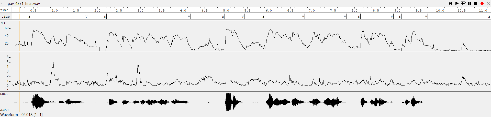

PAV - P2: detección de actividad vocal (VAD)
============================================

Esta práctica se distribuye a través del repositorio GitHub [Práctica 2](https://github.com/albino-pav/P2),
y una parte de su gestión se realizará mediante esta web de trabajo colaborativo.  Al contrario que Git,
GitHub se gestiona completamente desde un entorno gráfico bastante intuitivo. Además, está razonablemente
documentado, tanto internamente, mediante sus [Guías de GitHub](https://guides.github.com/), como
externamente, mediante infinidad de tutoriales, guías y vídeos disponibles gratuitamente en internet.


Inicialización del repositorio de la práctica.
----------------------------------------------

Para cargar los ficheros en su ordenador personal debe seguir los pasos siguientes:

*	Abra una cuenta GitHub para gestionar esta y el resto de prácticas del curso.
*	Cree un repositorio GitHub con el contenido inicial de la práctica (sólo debe hacerlo uno de los
	integrantes del grupo de laboratorio, cuya página GitHub actuará de repositorio central del grupo):
	-	Acceda la página de la [Práctica 2](https://github.com/albino-pav/P2).
	-	En la parte superior derecha encontrará el botón **`Fork`**. Apriételo y, después de unos segundos,
		se creará en su cuenta GitHub un proyecto con el mismo nombre (**P2**). Si ya tuviera uno con ese 
		nombre, se utilizará el nombre **P2-1**, y así sucesivamente.
*	Habilite al resto de miembros del grupo como *colaboradores* del proyecto; de este modo, podrán
	subir sus modificaciones al repositorio central:
	-	En la página principal del repositorio, en la pestaña **:gear:`Settings`**, escoja la opción 
		**Collaborators** y añada a su compañero de prácticas.
	-	Éste recibirá un email solicitándole confirmación. Una vez confirmado, tanto él como el
		propietario podrán gestionar el repositorio, por ejemplo: crear ramas en él o subir las
		modificaciones de su directorio local de trabajo al repositorio GitHub.
*	En la página principal del repositorio, localice el botón **Branch: master** y úselo para crear
	una rama nueva con los primeros apellidos de los integrantes del equipo de prácticas separados por
	guion (**fulano-mengano**).
*	Todos los miembros del grupo deben realizar su copia local en su ordenador personal.
	-	Copie la dirección de su copia del repositorio apretando en el botón **Clone or download**.
		Asegúrese de usar *Clone with HTTPS*.
	-	Abra una sesión de Bash en su ordenador personal y vaya al directorio **PAV**. Desde ahí, ejecute:

		```.sh
		git clone dirección-del-fork-de-la-práctica
		```

	-	Vaya al directorio de la práctica `cd P2`.
	-	Añada la etiqueta `origin` a su copia del repositorio. Esto es útil para facilitar los *push* y
		*pull* al repositorio original:
		```.sh
		git remote add origin dirección-del-fork-de-la-práctica
		```
	-	Cambie a la rama **fulano-mengano** con la orden:

		```.sh
		git checkout fulano-mengano
		```

*	A partir de este momento, todos los miembros del grupo de prácticas pueden trabajar en su directorio
	local del modo habitual.
	-	También puede utilizar el repositorio remoto como repositorio central para el trabajo colaborativo
		de los distintos miembros del grupo de prácticas; o puede serle útil usarlo como copia de
		seguridad.
	-	Cada vez que quiera subir sus cambios locales al repositorio GitHub deberá confirmar los
		cambios en su directorio local:

		```.sh
		git add .
		git commit -m "Mensaje del commit"
		```

		y, a continuación, subirlos con la orden:

		```.sh
		git push -u origin fulano-mengano
		```

*	Al final de la práctica, la rama **fulano-mengano** del repositorio GitHub servirá para remitir la
	práctica para su evaluación utilizando el mecanismo *pull request*.
	-	Vaya a la página principal de la copia del repositorio y asegúrese de estar en la rama
		**fulano-mengano**.
	-	Pulse en el botón **New pull request**, y siga las instrucciones de GitHub.


Entrega de la práctica.
-----------------------

Responda, en este mismo documento (README.md), los ejercicios indicados a continuación. Este documento es
un fichero de texto escrito con un formato denominado _**markdown**_. La principal característica de este
formato es que, manteniendo la legibilidad cuando se visualiza con herramientas en modo texto (`more`,
`less`, editores varios, ...), permite amplias posibilidades de visualización con formato en una amplia
gama de aplicaciones; muy notablemente, **GitHub**, **Doxygen** y **Facebook** (ciertamente, :eyes:).

En GitHub. cuando existe un fichero denominado README.md en el directorio raíz de un repositorio, se
interpreta y muestra al entrar en el repositorio.

Debe redactar las respuestas a los ejercicios usando Markdown. Puede encontrar información acerca de su
sintáxis en la página web [Sintaxis de Markdown](https://daringfireball.net/projects/markdown/syntax).
También puede consultar el documento adjunto [MARKDOWN.md](MARKDOWN.md), en el que se enumeran los
elementos más relevantes para completar la redacción de esta práctica.

Recuerde realizar el *pull request* una vez completada la práctica.

Ejercicios
----------

### Etiquetado manual de los segmentos de voz y silencio

- Etiquete manualmente los segmentos de voz y silencio del fichero grabado al efecto. Inserte, a 
  continuación, una captura de `wavesurfer` en la que se vea con claridad la señal temporal, el contorno de
  potencia y la tasa de cruces por cero, junto con el etiquetado manual de los segmentos.

	

- A la vista de la gráfica, indique qué valores considera adecuados para las magnitudes siguientes:

	* Incremento del nivel potencia en dB, respecto al nivel correspondiente al silencio inicial, para
	  estar seguros de que un segmento de señal se corresponde con voz.
	  
	  	```.sh
	  	Incremento nivel de potencia respecto silencio: alrededor de 10dB
	  	```

	* Duración mínima razonable de los segmentos de voz y silencio.
	
		**`La imagen siguiente corresponde, a la ejecución del cat de nuestro etiquetado, en el vemos los 		intervalos de la silencio y voz de la señal `**
	
		
	
	  	```.sh
	  	Duración mínima voz: 400 ms
		Duración mínima silencio: 100 ms
	  	```

	* ¿Es capaz de sacar alguna conclusión a partir de la evolución de la tasa de cruces por cero?

	  	```.sh
	  	Se puede observar que cuando el sonido es fricativo, aumenta la tasa de cruzes por cero. Sin embargo para sonidos sonoros, no se observa estos picos 
		de la tasa de cruces por cero.
	  	```


### Desarrollo del detector de actividad vocal

- Complete el código de los ficheros de la práctica para implementar un detector de actividad vocal en
  tiempo real tan exacto como sea posible. Tome como objetivo la maximización de la puntuación-F `TOTAL`.

- Inserte una gráfica en la que se vea con claridad la señal temporal, el etiquetado manual y la detección
  automática conseguida para el fichero grabado al efecto. 

- Explique, si existen. las discrepancias entre el etiquetado manual y la detección automática.

- Evalúe los resultados sobre la base de datos `db.v4` con el script `vad_evaluation.pl` e inserte a 
  continuación las tasas de sensibilidad (*recall*) y precisión para el conjunto de la base de datos (sólo
  el resumen).
  
  **`Una vez hecha toda la implementacion del código por parte del etiquetado, observamos los resultados en la siguiente imágen, en ella vemos el etiquetado manual, después una primera implementación en las que observamos que el etiquetado automático encuentra unos fragmentos de silencio muy pequeños, y finalmente otra implementación, en la que conseguimos eliminar estos fragmentos cortos. alrededor de 200ms que nossotros no clasificamos como silencio. Se puede observar que en la última transcripcción hay segmentos repetidos, esto es debido a que el sistema actual al detectar el canvio de estado de S a V o bien de V a S imprime el segmento directamente en el documento, más adelante se observa una gráfica con una transcripción automatica que corrije este problema.`**


A partir de este punto, explicaremos el código elaborado.

### Código del fichero **vad.c**

#### Constantes y umbrales

```c
const float FRAME_TIME = 10.0F; /* in ms. */
const int N_INIT = 4;                   /*iteraciones iniciales sobre las que haremos medias de las features*/
const int UNDECIDED_V_FRAMES = 1;       /*Tramas de ST_MAYBE_VOICE máximas*/
const int UNDECIDED_S_FRAMES = 9;       /*Tramas de ST_MAYBE_SILENCE máximas*/
const float LLINDAR_FRIC = 0.9;         /*Coeficiente para el umbral de las fricativas*/
const float ZCR_LOW = 1.4;              /*Coeficiente para el umbral de ZCR baja*/
const float ZCR_HIGH = 1.4;             /*Coeficiente para el umbral ze ZCR alta*/
const float AMPLITUDE_OFFSET = 3.6;     /*Coeficiente para el umbral de amplitud*/
```
Estas son las constantes que nos maximizan la FSCORE de la base de datos, otra variable que nos maximiza la FSCORE es alfa1, la cual por defecto es 2 i se puede canviar su valor mediante la ejecucion desde el terminal.

#### Cálculo de las Features

Para realizar el cálculo de las features (Potencia, ZCR e Amplitud media), hacemos uso de las funciones elaboradas en la práctica. Por lo tanto, la función __*Features compute_features*__, la qual nos guarda los valores calculados de Potencia, ZCR e amplitud media en la variable feat.

```c
Features compute_features(const float *x, int N) {
 
  Features feat;
  feat.p = compute_power(x,N);
  feat.zcr = compute_zcr(x, N, N/(FRAME_TIME*1e-03));
  feat.am = compute_am(x, N);
  
  return feat;
}

```

### Implementación del FSA (Finite State Automata), para la detección de voz

Como se puede observar en el código de abajo se ha optado por el uso de booleanos, esto es debido a que al utilizar las condiciones para la feature de zcr  (cruzes por cero), para diferenciar fonemas fricativos, los cuales tienen una tasa de cruces por cero mayor, una tasa de cruces por cero menor al ser una vocal o fonema sonoro i una tasa media de cruces por cero cuando hay ruido, por ese motivo, se opto el uso  de booleanos, para simplificar la comprensión del código. Para hacer uso de ellos, hemos tenido que añadir la libreia <stdbool.h>

```c
  Features f = compute_features(x, vad_data->frame_length);
  vad_data->last_feature = f.p; /* save feature, in case you want to show */
  
  bool voice_zcr_low = f.zcr < vad_data->umbral_zcr_bajo;
  bool voice_zcr_high = f.zcr > vad_data->umbral_zcr_alto;
  bool silence_zcr = (f.zcr > vad_data->umbral_zcr_bajo) && (f.zcr < vad_data->umbral_zcr_alto);

  switch (vad_data->state) {
  case ST_INIT:                                                             /*Durante N_INIT muestras iniciales se calculara los umbrales de la señal*/
    if(vad_data->frame < N_INIT) {
      vad_data->umbral = vad_data->umbral + f.p;
      vad_data->umbral_zcr_bajo = vad_data->umbral_zcr_bajo + f.zcr;
      vad_data->umbral_zcr_alto = vad_data->umbral_zcr_alto + f.zcr;
      vad_data->umbral_amplitud = vad_data->umbral_amplitud + f.am; 
    }else{
      vad_data->state = ST_SILENCE;
      vad_data->umbral = vad_data->umbral/N_INIT + vad_data->alfa1;
      vad_data->umbral_fric = vad_data->umbral + vad_data->alfa1/LLINDAR_FRIC;
      vad_data->umbral_zcr_bajo = vad_data->umbral_zcr_bajo / (N_INIT*ZCR_LOW);
      vad_data->umbral_zcr_alto = ZCR_HIGH * vad_data->umbral_zcr_alto/N_INIT;
      vad_data->umbral_amplitud = vad_data->umbral_amplitud*(AMPLITUDE_OFFSET/N_INIT);
      
    }
    break;

  case ST_SILENCE:
    if ( (f.p > vad_data->umbral_fric)  ||  (f.am > vad_data->umbral_amplitud)) {
      vad_data->state = ST_MAYBE_VOICE;
    }
      vad_data->last_state = ST_SILENCE;
      vad_data->last_defined_frame = vad_data->frame;

    break;

  case ST_VOICE:
    if ((f.p < vad_data->umbral_fric && f.am < vad_data->umbral_amplitud) && silence_zcr)
      vad_data->state = ST_MAYBE_SILENCE;
    vad_data->last_state = ST_VOICE;
    vad_data->last_defined_frame = vad_data->frame;
    
    break;

  case ST_MAYBE_SILENCE:
    if (((f.p > vad_data->umbral && voice_zcr_low) || (f.p < vad_data->umbral_fric && voice_zcr_high))  && (f.am > vad_data->umbral_amplitud)){
      vad_data->state = ST_VOICE;
    }
    else if((vad_data->frame - vad_data->last_defined_frame) == UNDECIDED_S_FRAMES){
      vad_data->state = ST_SILENCE;
    }
    break;
  
  case ST_MAYBE_VOICE:
    if ((f.p < vad_data->umbral_fric  && silence_zcr) || (f.am < vad_data->umbral_amplitud)){
      vad_data->state = ST_SILENCE;
    }
    else if((vad_data->frame - vad_data->last_defined_frame) == UNDECIDED_V_FRAMES){
      vad_data->state = ST_VOICE;
    }
    break;

  case ST_UNDEF:
    break;
  }
```

FScore de nuestra frase


Al evaluar el resultado sobre nuestra frase grabada (pav_4171.lab) y utilizando el parámetro alfa1= 2, obtenemos una F-score de 91.766%. Podemos observar como los segmentos de voz detectados automaticamente son un poco mayores, por lo tanto detectamos practicamente todos los segmentos de voz.

FScore sobre la base de datos


Haciendo la misma evaluación sobre la base de datos proporcionada y utilizando el mismo parámetro alfa1, obtenemos una F-score de 94.108%. 

#### Resultado final del etiquetado automático


En la gráfica anterior de etiquetado automático, podemos observar algunas pequeñas diferencias respecto al etiquetado manual. Nos fijamos básicamente en dos.
La primera, un pequeño retardo para empezar a detectar el silencio. El detector automático racciona un poco tarde cuando la voz ya ha acabado. Aunque es una diferencia mínima.
La segunda diferencia, es con los comienzos de la voz. El detector, empieza a mostrar como voz un poco más tarde, y la confunde con un silencio. Aunque, este segundo problema se muestra menos, y está bastante ajustado.

### Trabajos de ampliación

#### Cancelación del ruido en los segmentos de silencio

- Si ha desarrollado el algoritmo para la cancelación de los segmentos de silencio, inserte una gráfica en
  la que se vea con claridad la señal antes y después de la cancelación (puede que `wavesurfer` no sea la
  mejor opción para esto, ya que no es capaz de visualizar varias señales al mismo tiempo).
  
  Se ha intentado hacer pero el resultado actual hace que una señal de la misma longitud que la de entrada pero de silencio.

#### Gestión de las opciones del programa usando `docopt_c`

- Si ha usado `docopt_c` para realizar la gestión de las opciones y argumentos del programa `vad`, inserte
  una captura de pantalla en la que se vea el mensaje de ayuda del programa.
  
  Solo se ha añadido la posibilidad de un argumento alfa1 que corresponde con el umbral de potencia.
  
  

  Usamos este umbral para detectar cuando estamos en un segmento de voz y cuando en uno de silencio.
  Lo incorporamos en vad_docopt.h (donde también modificamos el mensaje de ayuda del programa):
  
  
  
  Después, añadimos el umbral a la estructura de datos VAD_DATA incluida en vad.c:
  
  

  Y por último, fijamos un valor en el main_vad.c:
  
  

### Contribuciones adicionales y/o comentarios acerca de la práctica

- Indique a continuación si ha realizado algún tipo de aportación suplementaria (algoritmos de detección o 
  parámetros alternativos, etc.).
  
  En la parte donde se explica el código ya se ha explicado la mayoria de cosas, cabria destacar la forma en la que evitamos la repetición de segmentos de silencio ó voz, el cual se puede observar su codigo en  main_vad.c

- Si lo desea, puede realizar también algún comentario acerca de la realización de la práctica que
  considere de interés de cara a su evaluación.


### Antes de entregar la práctica

Recuerde comprobar que el repositorio cuenta con los códigos correctos y en condiciones de ser 
correctamente compilados con la orden `meson bin; ninja -C bin`. El programa generado (`bin/vad`) será
el usado, sin más opciones, para realizar la evaluación *ciega* del sistema.
